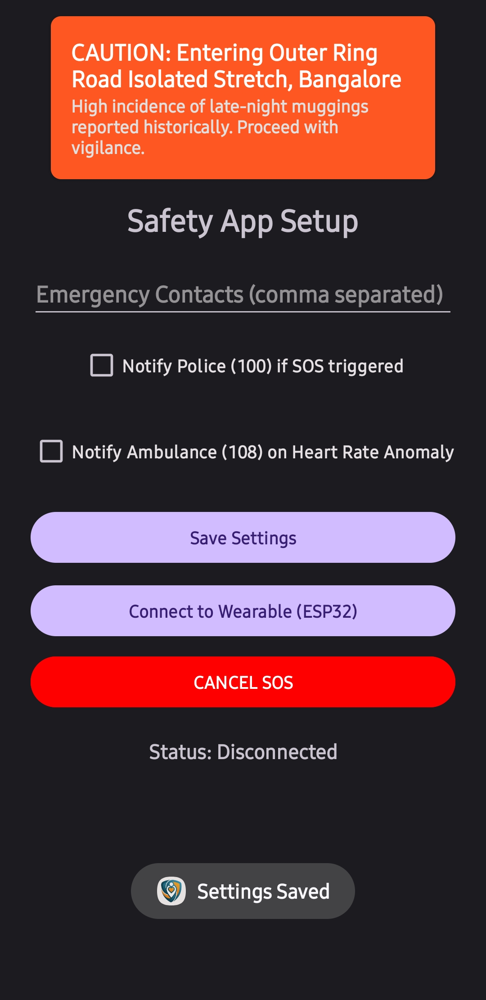
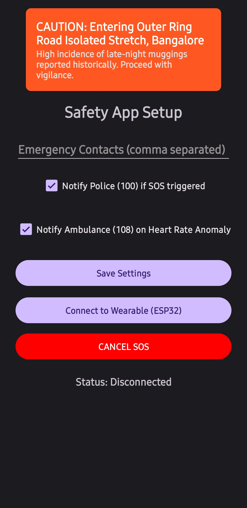
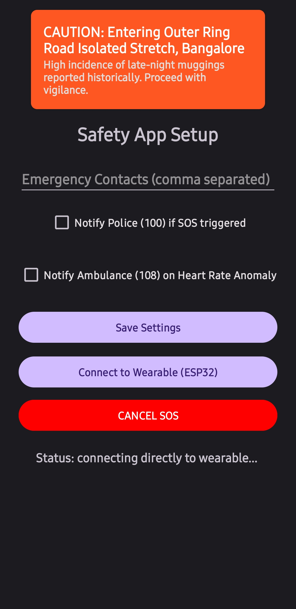
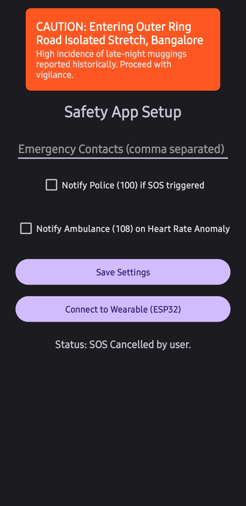
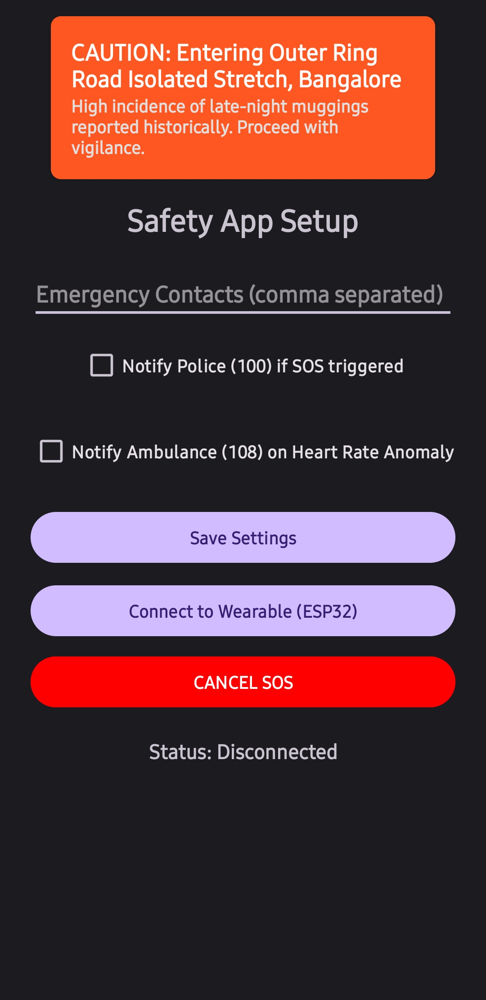

# smart-alert-wearable
A smart triage safety wearable that locally verifies physical distress and warns users of high-risk zones.
# 🛡️ Sentinel Edge: Autonomous Multi-Sensor Safety Wearable

> **Moving personal safety from reactive panic buttons to proactive, autonomous threat intelligence.** Built for [Insert Hackathon Name].

## 📖 The Problem
Current personal safety applications rely on a critical flaw: they assume the victim has the conscious ability to manually press a panic button or reach for their phone. In cases of sudden assault, medical collapse, or exposure to incapacitating chemicals, manual devices are useless. Furthermore, existing automated solutions suffer from high false-positive rates.

## 💡 Our Solution
Sentinel Edge is a two-part ecosystem:
1. **The Edge Node (Hardware):** A continuous monitoring wearable that utilizes a custom "2-out-of-3" sensor fusion gate to mathematically verify physical distress.
2. **The Predictive Hub (Software):** An Android companion app that acts as a Smart Triage center, running a Threat Intelligence engine to warn users of high-risk zones *before* an attack occurs, and autonomously routing emergency services when an attack is verified.

---

## ✨ Core Features

* **⚡ 2-out-of-3 Fusion Gate:** Eliminates false positives. The system only triggers an autonomous SOS if at least two distinct sensors (Pulse, Accelerometer, Gas) cross danger thresholds within a 5-second overlapping window.
* **🏥 Smart Triage Dispatch:** Reads the specific hardware sensors triggered to route the correct help. It sends general distress and GPS data to the Police (100) for physical struggles, but explicitly routes a medical distress signal to Ambulances (108) if a heart rate anomaly is detected.
* **🧠 Predictive Threat Engine (Heuristic UI):** Cross-references the user's real-time GPS coordinates and the time-of-day against a localized dataset of historical danger zones, turning the UI orange to warn the user to stay vigilant.
* **🔗 Zero-Delay BLE:** Utilizes direct MAC-address targeting over the Nordic UART Service to ensure instant connectivity without draining smartphone battery via constant scanning.

---

## 🏗️ System Architecture

## 🏗️ System Architecture

### Hardware Pinout (ESP32 WROOM-32U)
---

## 📸 Frontend Workflow & State Management

To ensure a seamless user experience, the companion app features real-time dynamic UI updates and robust error handling.

<table align="center">
  <tr>
    <td align="center">
      <b>1. Default Dashboard</b> 
       
      
    </td>
    <td align="center">
      <b>2. Settings Confirmation</b> 
       
      
    </td>
    <td align="center">
      <b>3. Initialization</b> 
       
      
    </td>
  </tr>
  <tr>
    <td align="center">
      <b>4. Error Handling</b> 
       
      
    </td>
    <td align="center">
      <b>5. Failsafe Cancellation</b> 
       
      
    </td>
    <td align="center">
      <b>6. Smart Triage Active</b> 
       
      
    </td>
  </tr>
</table>

---

## 🚀 How to Run Locally

### Hardware Setup
1. Flash the ESP32 with the MicroPython firmware.
2. Upload `main.py` from the `/Hardware` folder to the board.
3. Ensure sensors are wired according to the pinout table above.

### Android Setup
1. Clone this repository and open the `/Android-App` folder in Android Studio.
2. Ensure you have targeted Android SDK version 24 or higher.
3. Update the `ESP32_MAC_ADDRESS` variable in `MainActivity.java` to match your specific wearable's MAC address.
4. Build and install the APK on a physical Android device (Bluetooth logic cannot be tested on an emulator).
5. Grant Location, Bluetooth, and SMS permissions upon startup.

---
*Built with passion by Team Sentinel Edge.*
